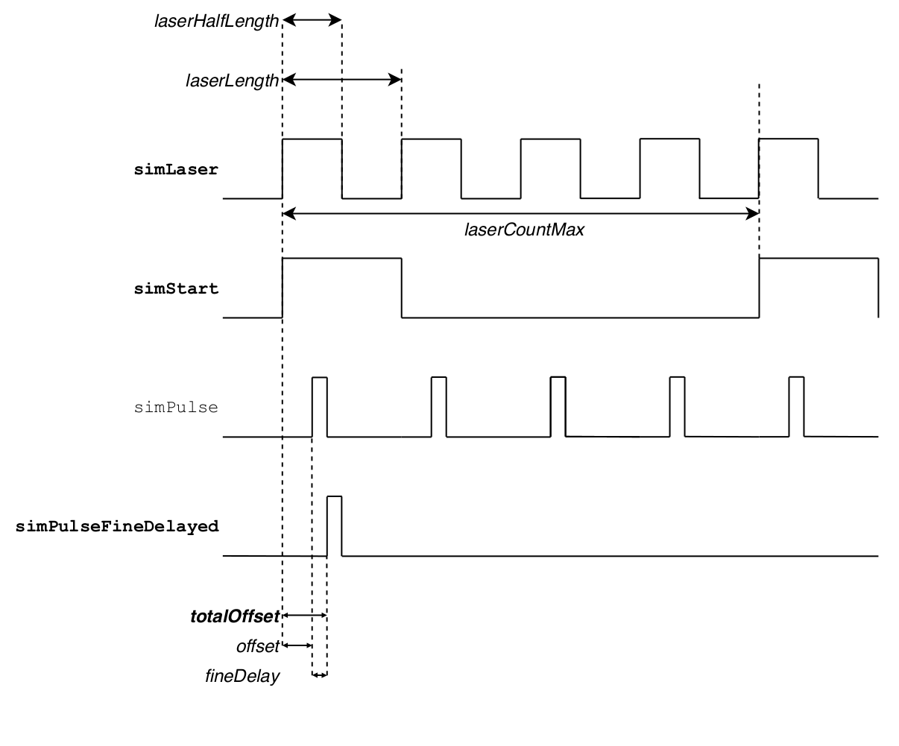
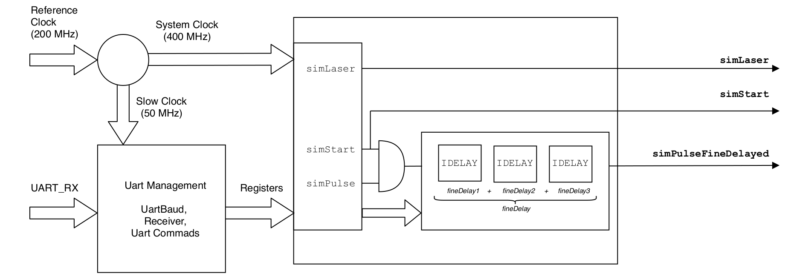
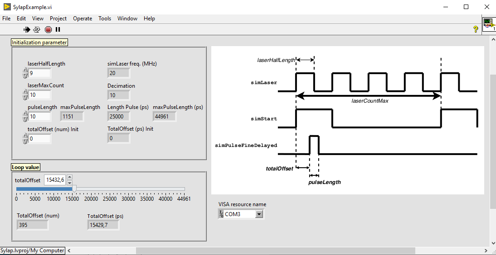
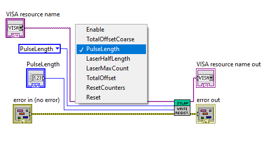

# SYLAP

**S**imulate
**Y**our
**L**aser
**A**nd
**P**hotons


SYLAP is **a pulse generator** which it has been developed to characterize a Time-to-Digital-Converter (TDC) for fluorescence microscopy application. It generates a reference clock (LaserClock) and a pulse with lentgh and offset tunable. **The pulse delay resolution is 39 ps.** It allows to generate signals useful to simulate a Laser Clock and a Photon pulses. The HDL design is synthesizable on Xilinx Vivado 2017.4 and it can run on Xilinx Kintex-7 family FPGA.




## FUNCTIONALITY SCHEME ##




## DRAFT TEXT ##

The internal SYLAP system clock (SysClk) is a 400 MHz (2.5 ns period) and the Laser Clock is simulated by decimating such clock. 

- The parameter `laserHalfLength` corresponds to the half-period of the Laser Clock. So the laser frequency is `laser_MHz=400/(2*(laserHalfLength+1))`. The minimum value of the laserHalfLength is 1, so the maximum frequency for the Laser Clock is 100 MHz.
 
- The pulse length is based on the SysClk, so the granularity is 2.5 MHz. 

- The pulse offset of the generated pulse has the FPGA Kintex7 IDELAY primitive resolution on a 400MHz, which corresponds to `[1/(64*400MHz)] = 39 ps`.

## DRAFT REGISTER ##

| Register | Size | Units | Comments | 
| ------ | ------ | ------ | ------ |
| pulseLength | [31:0] | sysClk  (2.5 ns)| length of the pulse generated |
| pulseOffset | [31:0] | sysClk (2.5 ns) | offset of the pulse generated | 
| pulseOffsetPlusLength | [31:0] | sysClk (2.5 ns) | the sum of offset and pulse length |
| laserHalfLength | [31:0] | sysClk (2.5 ns) | half length of cycle clock |
| *fineDelay* | [5:0] | sysClk / 64  (39 ps)| delay added to the pulse generated |
|   *&nbsp; &nbsp; &nbsp; fineDelay1* | [4:0] | sysClk / 64  (39 ps)| partial delay added to the pulse generated |
|   *&nbsp; &nbsp; &nbsp; fineDelay2* | [4:0] | sysClk / 64  (39 ps)| partial delay added to the pulse generated |
|   *&nbsp; &nbsp; &nbsp; fineDelay3* | [4:0] | sysClk / 64  (39 ps)| partial delay added to the pulse generated |
| laserCountsMax | [7:0] | syslaserClock cycle | decimation, number of laser clock needed to generate a simStart|
| enableGenerator | - | - | enable the generation of signal|

For programming a register in SYLAP the protocol is the follow:
### UART PROTOCOL ###


## UART ##

SYLAP uses the UART to USB provided by the Xilinx Kintex-7 Evaluation Board. 

#### UART Configuration ####

| BaudRate | ByteSize | Parity |
| ------ | ------ | ------ |
| 115200 | 8 | N |

#### UART COMMANDS #####

|  n-th Byte | 1 | 2 | 3 | 4 | 5 | 6 | 7 | 8 | 
| ------ | ------ |------ |------ |------ |------ |------ |------ |------ |
| hexValue  |  0xAA | 0xBB | 0xCC | REG + 0x00 | data[23:15] | data[15:7] | data[7:0] |  REG + 0x80 |

#### PROGRAMMABLE REGISTER ####

| REG | Data Bits | Meaning | 
| ------ | ------ |------ |
| 0x00  |  [0] | `1` enable, `0` disable generator |
| 0x02  |  [15:0] | `pulseLength` |
| 0x03  |  [15:0] | `laserLengthHalf` in 1/400MHz |
| 0x04  |  [7:0] | `laserCountsMax` (decimation) |
| 0x11  |  [23:0] | `totalOffset` |

*Other registers are available but they are used only for debug purpose.*

##### Note on the `totalOffset` register #####

| `totalOffset[23:8]` | `totalOffset[7:2]` | `totalOffset[1:0]` | 
| ------ | ------ |------ |
| offset | fineDelay | xx |

The totalOffset can be calculated starting from the wanted dealy with the following formula:

`totalOffset[23:0] =  delay [ps] * 4 * (64*400/1E6)`

in the python notebook example the `setTotalOffset(delayValue)` ignores the non-used bits:

`delayValue = totalOffset[23:2]`

that corresponds to

`delayValue =  delay [ps] * (64*400/1E6)`

so 1 unit corresponds to 39 ps.

##### Note on the `fineDelay` register #####

The "fine" delayer uses the Xilinx IDELAY/IDELAYCTRL primitives. As the IDELAYCTRL uses the sysClk at 400 MHz, the granularity of the IDELAY corresponds to 1/64th of the sysclk period 39 ps. In the IDELAY the delay has only 5 bits so value can be set between 0-31 steps. In order to cover a complete sysClk period it is needed to extend the range between 0-63 steps by using three IDELAY in series. For this this the value *fineDelay* is "splitted" as follow (pseudo code): 

```
if fineDelay[5:0] == 63:
- fineDelay1[4:0] = "11111"
- fineDelay2[4:0] = "11111"
- fineDelay3[4:0] = "00001"
else:
- fineDelay1[4:0]=fineDelay[5:1]                             #that is fineDelay1[4:0] = integer(fineDelay \ 2)                        
- fineDelay2[4:0]=fineDelay[5:1]+fineDelay[0]                #that is fineDelay2[4:0] = integer(fineDelay \ 2) + parity(fineDelay)
- fineDelay3[4:0]=0                                          #that is fineDelay3[4:0] = "00000"
```

## External code: ##
The code for UART interface is from https://github.com/jamieiles/uart under GPLv2.

# SYLAP Labview Libraries  #





# License & Copyright

SYLAP - Simulate Your Laser and Photon - pulse generator\
Copyright (c) 2021, Molecular Microscopy & Spectroscopy,\
Italian Institute of Technology. All rights reserved.

Unless otherwise stated, SYLAP is licensed under
**license GPLv2**, see details in [LICENSE](LICENSE) file.

**In addition to the terms of the license, we ask to acknowledge the use** \
**of SYLAP in scientific articles by citing/linking this project**

# Contact us

Do you need help to run SYLAP? Do you have comments or questions? Do not hesitate to contact us at giuseppe.vicidomini@iit.it. 


